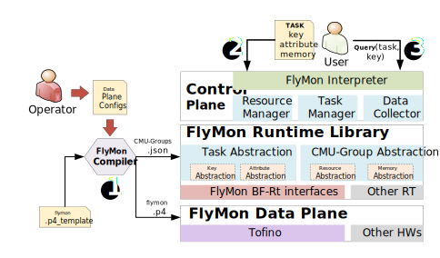

<h1 align="center">
  <br>
  FlyMon
  <br>
</h1>

<h4 align="center">A reference implementation of SIGCOMM'22 Paper <a href="www.google.com" target="_blank">FlyMon</a>.</h4>

<p align="center">
  <a href="#key-features">Key Features</a> •
  <a href="#how-to-use">How To Use</a> •
  <a href="#hardware">Hardware Implementation</a> •
  <a href="#simulation">Simulation Framework</a> •
  <a href="#license">License</a>
</p>

## Key Features

* P4-16 based hardware implementation.
* Jinja2 templates used to generate P4 codes according to variable configurations (e.g., CMU-Groups, Memory Size, Candidate Key Set).
* Several built-in algorithms used to measure various flow attributes.
* A reference control plane framework realizing task reconfiguration, resource management, data collection.
* A simulation framework to fast explore algorithms' accuracy.

> :question: **NOTE 1** : We are improving the richness and reliability of this repository. Please submit an issue if you find any bugs/problems.

> :exclamation: **NOTE 2** : This repository currently serves as an early exploration for academics purpose. We do not provide production-level quality assurance.

## How To Use

### Environment and Dependencies

We implement FlyMon based on P4-16, with the SDE Version 9.7.0. Please use at least a version of SDE higher than this one.

Hardware Requirements：
* Tofino-based Hardware Switch (e.g., Wdege-100BF-XX)
* At least one Server with QSFP28 connectors and wires.

Software Requirements:
* Switch OS: 4.14.151-OpenNetworkLinux
* Python 3.8.10 
* SDE Version 9.7.0+ (the same is best)

There are some dependencies for control plane functions. To install them.
```bash
git clone "https://github.com/NASA-NJU/FlyMon.git"
cd FlyMon
pip install -r ./requirements.txt
```

> 'python' and 'pip' refer to the python version of 3.8.10 in this document.

### Overview

<div align="center">

</div>


### Get Started
Below are running steps of the codes.


**Step #1**. Generate a customized FlyMon dataplane and build them.

```bash
python flymon_compiler.py -n 1 
```

The above command will generate two types of files. a) P4-based data plane codes located in [p4src](p4src/). b) Json-based Data plane configurations used to help initialize the control plane interfaces.

Then, you can build the p4 codes with bf-sde. Here we give a setup script if you don't known how to compile the codes.

```bash
# If we are working are SDE 9.7.0
./setup.sh
```

**Step #2**. Run the p4 program and login to FlyMon interactive command line.

```bash
# Load the P4 program
$SDE/run_switchd.sh -p <FlyMon>

# Login to FlyMon console
python control_plane/main_loop.py

flymon> show_status -g 1

----------------------------------------------------
    ______   __            __  ___                
   / ____/  / /  __  __   /  |/  /  ____     ____ 
  / /_     / /  / / / /  / /|_/ /  / __ \   / __ \
 / __/    / /  / /_/ /  / /  / /  / /_/ /  / / / /
/_/      /_/   \__, /  /_/  /_/   \____/  /_/ /_/ 
              /____/                                 
----------------------------------------------------
    An on-the-fly network measurement system.               
    
flymon> show_status -g 1
--------------------------------------------------------------------------------
                             Status of CMU-Group 1                              
--------------------------------------------------------------------------------
Compressed Key 1 (32b): hdr.ipv4.src_addr(0x00000000) - hdr.ipv4.dst_addr(0x00000000) - hdr.ports.src_port(0x0000) - hdr.ports.dst_port(0x0000) - hdr.ipv4.protocol(0x00)
Compressed Key 2 (16b): hdr.ipv4.src_addr(0x00000000) - hdr.ipv4.dst_addr(0x00000000) - hdr.ports.src_port(0x0000) - hdr.ports.dst_port(0x0000) - hdr.ipv4.protocol(0x00)
--------------------------------------------------------------------------------
Memory Status of CMU 1
| 0  | 0  | 0  | 0  | 0  | 0  | 0  | 0  | 0  | 0  | 0  | 0  | 0  | 0  | 0  | 0  | 0  | 0  | 0  | 0  | 0  | 0  | 0  | 0  | 0  | 0  | 0  | 0  | 0  | 0  | 0  | 0  |
Memory Status of CMU 2
| 0  | 0  | 0  | 0  | 0  | 0  | 0  | 0  | 0  | 0  | 0  | 0  | 0  | 0  | 0  | 0  | 0  | 0  | 0  | 0  | 0  | 0  | 0  | 0  | 0  | 0  | 0  | 0  | 0  | 0  | 0  | 0  |
Memory Status of CMU 3
| 0  | 0  | 0  | 0  | 0  | 0  | 0  | 0  | 0  | 0  | 0  | 0  | 0  | 0  | 0  | 0  | 0  | 0  | 0  | 0  | 0  | 0  | 0  | 0  | 0  | 0  | 0  | 0  | 0  | 0  | 0  | 0  |
--------------------------------------------------------------------------------
```

**Step #3**. Dynamically deploy a measurement task and view the CMU-Group status.

```bash
flymon> add_task key=hdr.ipv4.src_addr/32 attribute=frequency memory_size=65536
task 1 added.
```


## Simulation

### Single CMU-Group Implementation

The main branch is a reference implementation of single CMU-Group, which includes:
* P4-16 codes of the CMU-Group. We implement an additional task registration module and heavy key reporting module.
* A demo control plane which shows how to:
    * dynamically install measurement tasks.
    * dynamically allocate memory with different size.
    * collect deduplicated heavy keys and output to std-out.
    * configure the dynamic hash unit to generate an arbitrary compressed key in the compression stage (temporarily removed, see NOTE2 below). 

### Cross-stacking 9 CMU-Groups

To see the cross-stacking version of FlyMon, please checkout to the `stackable_cmug` branch.

### Strawman Implementation of CMU

To see the strawman solution (without optimizations on key-selection and attribute-operation), please checkout to the `strawman_solution` branch.

**NOTE#1** : for historical reasons, the compression unit (CU) is referred to as the shared compression stage. The execution unit (EU) is referred to as composable measurement unit (CMU). The transformable measurement unit (TMU) is referred to CMU-Group. We are working on refactoring the code to the correct component name.

**NOTE#2** : since INTEL [Open-Tofino](https://github.com/barefootnetworks/Open-Tofino/tree/master/p4-examples/p4_16_programs/tna_dyn_hashing) has not open-sourced the relevant code of the dynamic hash masking, we temporarily removed this part of the control plane code. Please update SDE to 9.7.0+ and get the sample code.
We  also remove `headers.p4` and `utils.p4`, which can be obtained at [Open-Tofino](https://github.com/barefootnetworks/Open-Tofino/tree/master/p4-examples/p4_16_programs/tna_dyn_hashing).

## Simulation

For the convenience of experimentation, we implemented a simulated version of FlyMon in C++ to test algorithms accuracy. Note that the simulation is not a simple implementation of the algorithms with c++. It also uses match-action tables to construct the measurement algorithms, just like the hardware implementation.
In addition, we constructed an automated testing framework to repeat the experiment. The simulation code is located in the [simulations](./simulations) directory.
